## Part 1.

* Взять официальный докер образ с nginx и выкачать его при помощи docker pull

* Проверить наличие докер образа через docker images
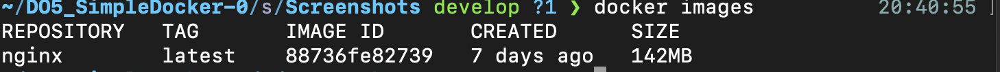

* Запустить докер образ через docker run -d [image_id|repository]
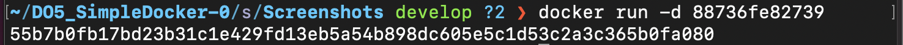

* Проверить, что образ запустился через docker ps

* Посмотреть информацию о контейнере через docker inspect [container_id|container_name]

* По выводу команды определить и поместить в отчёт размер контейнера, список замапленных портов и ip контейнера
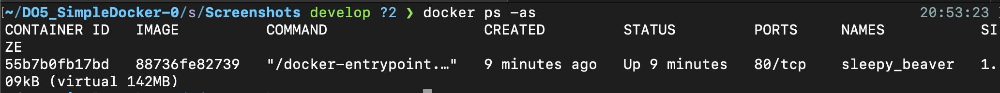

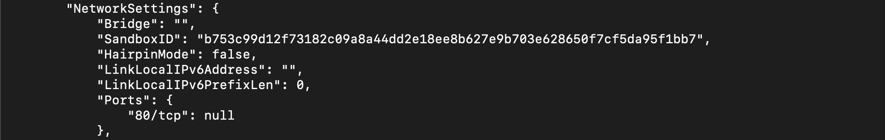

* Остановить докер образ через docker stop [container_id|container_name]

* Проверить, что образ остановился через docker ps
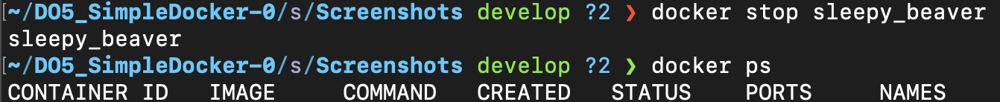

* Запустить докер с замапленными портами 80 и 443 на локальную машину через команду run
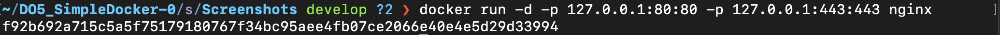

* Проверить, что в браузере по адресу localhost:80 доступна стартовая страница nginx
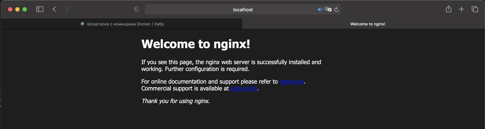

* Перезапустить докер контейнер через docker restart [container_id|container_name]
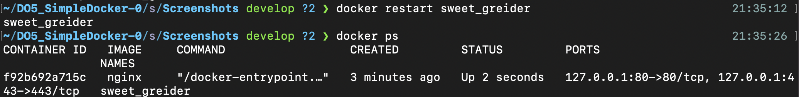

## Part 2.
* Прочитать конфигурационный файл nginx.conf внутри докер образа через команду exec

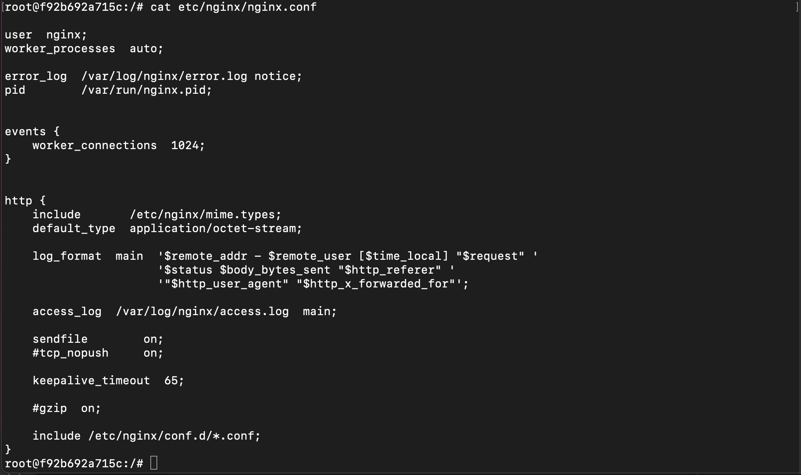

* Создать на локальной машине файл nginx.conf.   
Настроить в нем по пути /status отдачу страницы статуса сервера nginx
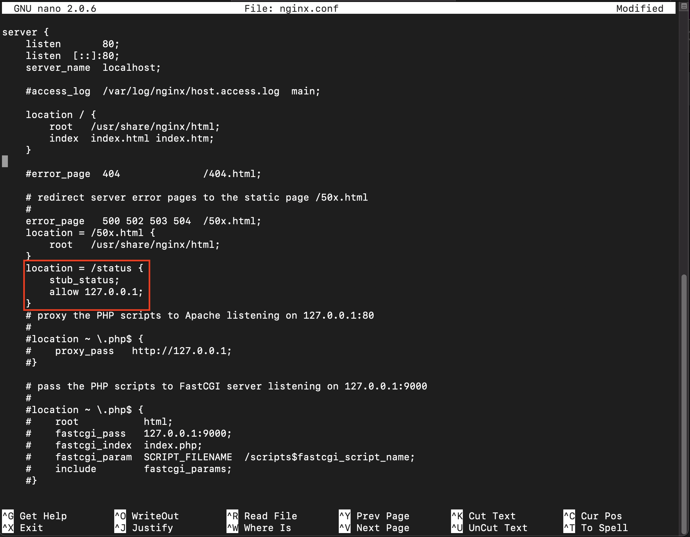

* Скопировать созданный файл nginx.conf внутрь докер образа через команду docker cp
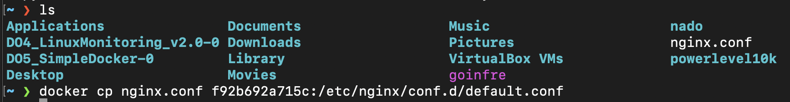

* Перезапустить nginx внутри докер образа через команду exec
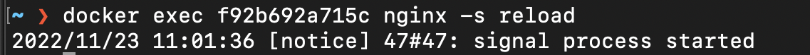

* Проверить, что по адресу localhost:80/status отдается страничка со статусом сервера nginx
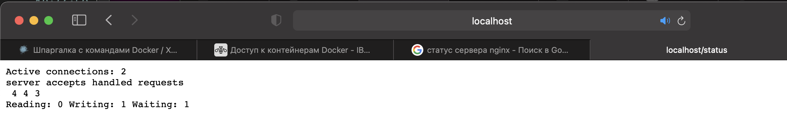

* Экспортировать контейнер в файл container.tar через команду export
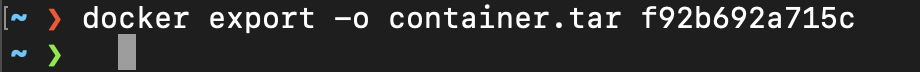

* Остановить контейнер
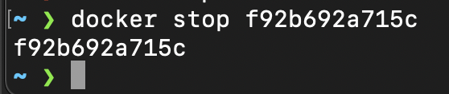

* Удалить образ через docker rmi [image_id|repository], не удаляя перед этим контейнеры
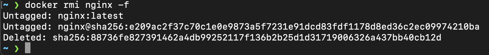

* Удалить остановленный контейнер
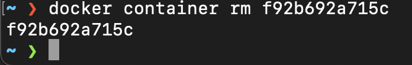

* Импортировать контейнер обратно через команду import
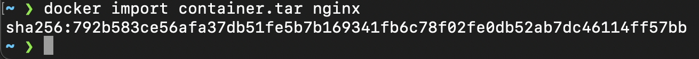

* Запустить импортированный контейнер
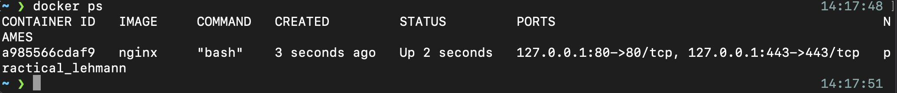

* Проверить, что по адресу localhost:80/status отдается страничка со статусом сервера nginx
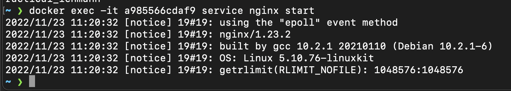
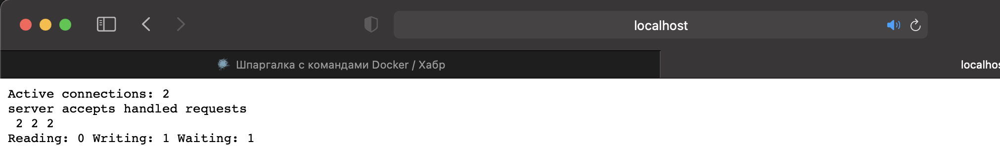

## Part 3.

* Запускаем nginx контейнер с портом 81.  
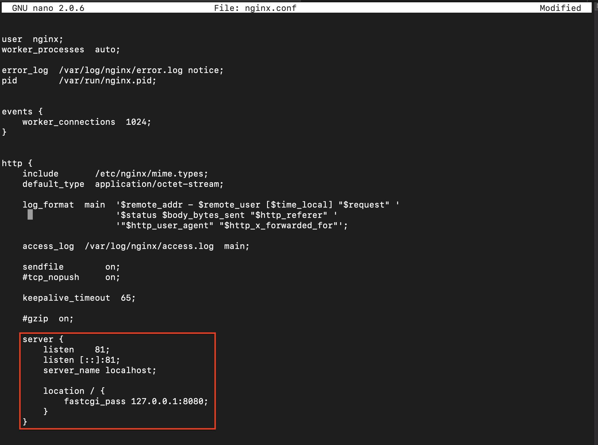
* Устанавливаем в него: apt install libfcgi-dev, apt install spawn-fcgi, apt install gcc
* Перекидываем нужные нам файлы в контейнер (nginx.conf обязательно перекинуть в папку nginx)
* Даём права скрипту и запускаем run.sh    
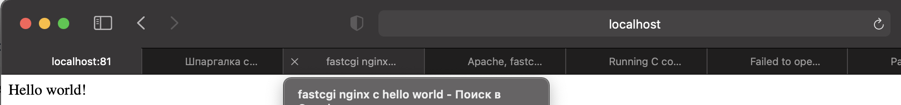
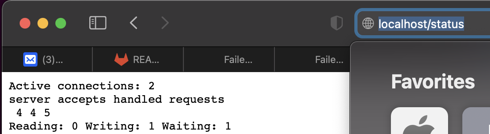

## Part 4.
* С помощью команды: "docker build -t hello_oworld:1.0 ."     
создаём образ и запускаем его
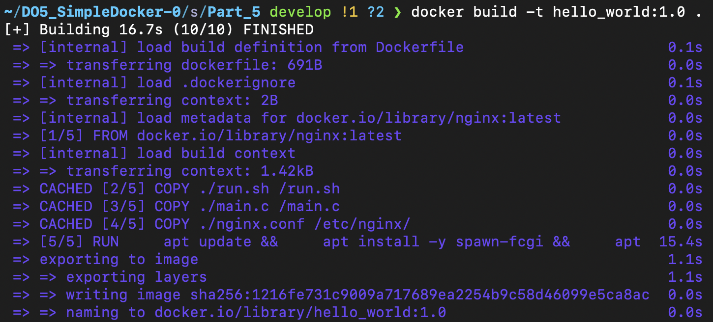
docker run -p 80:81 -d hello_world:1.0
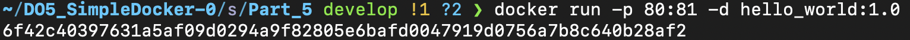

## Part 5.
* Устанавливаем dockle через brew.    
* Запускаем диагностику образа командой:    
 dockle -ak NGINX_GPGKEY hello_world:1.0   
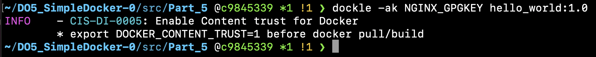

## Part 6.
docker-compose build
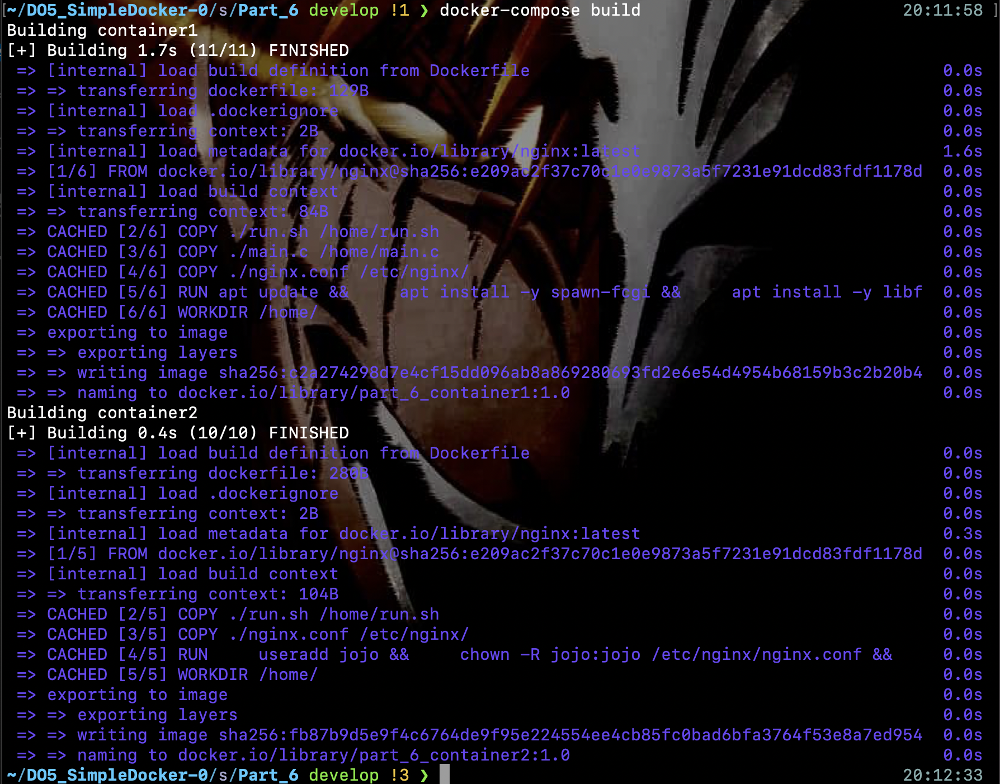

docker-compose up

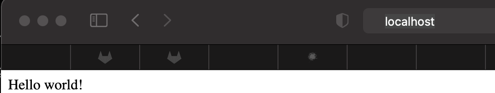
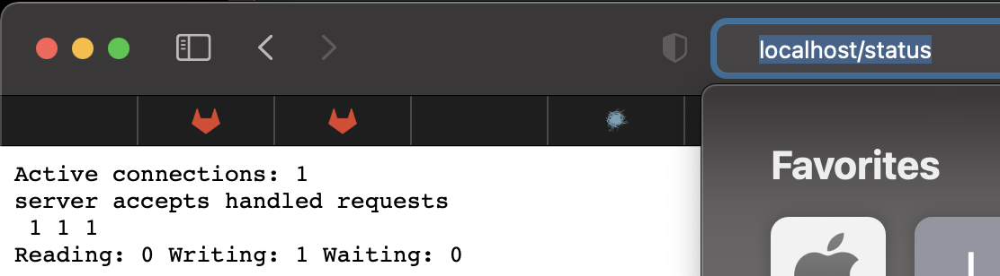
